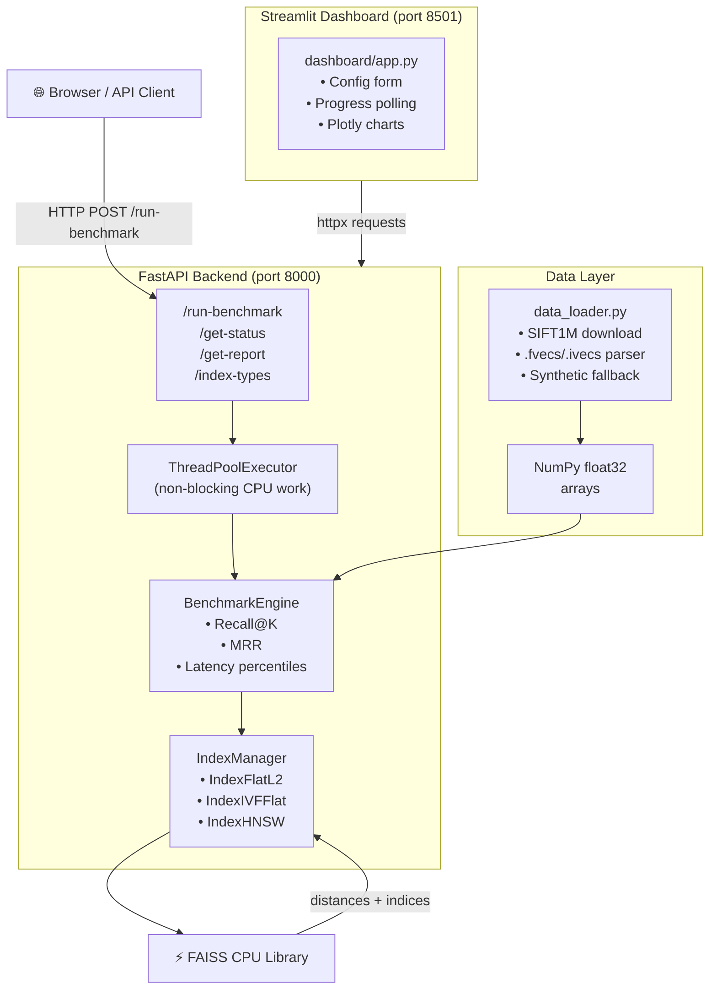

# 🔍 Vector Search Performance Profiler

A **production-ready**, full-stack system for benchmarking [FAISS](https://github.com/facebookresearch/faiss) index performance — measuring latency, Recall@K, and Mean Reciprocal Rank (MRR) across `IndexFlatL2`, `IndexIVFFlat`, and `IndexHNSW`.

---

## Table of Contents

1. [System Architecture](#system-architecture)
2. [Project Structure](#project-structure)
3. [Quick Start](#quick-start)
4. [API Reference](#api-reference)
5. [Performance Analysis](#performance-analysis)
6. [Deployment Guide](#deployment-guide)
7. [Development](#development)
8. [Configuration](#configuration)

---

## System Architecture



### Component Responsibilities

| Component | Responsibility |
|---|---|
| `dashboard/app.py` | Streamlit UI: config, polling, Plotly visualisations |
| `app/api/endpoints.py` | FastAPI routes; offloads CPU work via `run_in_executor` |
| `app/services/benchmark_engine.py` | Orchestrates benchmarks; computes Recall@K, MRR, latency |
| `app/services/index_manager.py` | Builds and queries all FAISS index types |
| `data/data_loader.py` | Downloads/parses SIFT1M; generates synthetic data |
| `app/core/config.py` | Centralised environment settings via `pydantic-settings` |
| `app/core/logger.py` | Structured JSON logging (human-readable in DEBUG mode) |
| `app/schemas/schemas.py` | Pydantic request/response models with field validation |

---

## Project Structure

```
vector-search-profiler/
├── app/
│   ├── __init__.py
│   ├── main.py                    # FastAPI app factory + middleware
│   ├── api/
│   │   ├── __init__.py
│   │   └── endpoints.py           # /run-benchmark, /get-status, /get-report
│   ├── core/
│   │   ├── __init__.py
│   │   ├── config.py              # Pydantic settings (env vars / .env)
│   │   └── logger.py              # Structured JSON / human logger
│   ├── schemas/
│   │   ├── __init__.py
│   │   └── schemas.py             # Pydantic I/O models
│   └── services/
│       ├── __init__.py
│       ├── index_manager.py       # FAISS index lifecycle management
│       └── benchmark_engine.py    # Latency + recall + MRR computation
├── dashboard/
│   └── app.py                     # Streamlit dashboard
├── data/
│   ├── __init__.py
│   └── data_loader.py             # SIFT1M download / .fvecs parser
├── tests/
│   ├── __init__.py
│   └── test_indexing.py           # Unit + integration tests (pytest)
├── Dockerfile                     # API image (multi-stage, non-root)
├── Dockerfile.dashboard           # Dashboard image
├── docker-compose.yml             # Full-stack local orchestration
├── requirements.txt               # Pinned dependencies
└── README.md
```

---

## Quick Start

### Prerequisites

- Python 3.11+
- Docker + Docker Compose (for containerised run)

### Local (no Docker)

```bash
# 1. Clone and enter the project
git clone https://github.com/your-org/vector-search-profiler.git
cd vector-search-profiler

# 2. Create a virtual environment
python -m venv .venv && source .venv/bin/activate

# 3. Install dependencies
pip install -r requirements.txt

# 4. Start the API (terminal 1)
uvicorn app.main:app --host 0.0.0.0 --port 8000 --reload

# 5. Start the dashboard (terminal 2)
streamlit run dashboard/app.py

# 6. Open http://localhost:8501 in your browser
```

### Docker Compose (recommended)

```bash
# Build and start both services
docker compose up --build

# API:        http://localhost:8000
# Dashboard:  http://localhost:8501
# API docs:   http://localhost:8000/docs

# Tear down
docker compose down -v
```

---

## API Reference

### `POST /run-benchmark`

Accepts benchmark configuration and returns a `job_id` immediately.

```json
// Request body
{
  "n_vectors": 50000,
  "n_queries": 1000,
  "dimension": 128,
  "index_types": ["IndexIVFFlat", "IndexHNSW"],
  "k_values": [1, 10, 100],
  "nlist": 100,
  "nprobe": 10,
  "hnsw_m": 32,
  "random_seed": 42
}

// Response (202 Accepted)
{
  "job_id": "3f7a2b1c-...",
  "status": "queued"
}
```

### `GET /get-status/{job_id}`

```json
// Response
{
  "job_id": "3f7a2b1c-...",
  "status": "running",   // queued | running | completed | failed
  "error": null
}
```

### `GET /get-report/{job_id}`

Returns nested metrics once the job is `completed`.

```json
{
  "job_id": "3f7a2b1c-...",
  "report": {
    "total_vectors": 50000,
    "total_queries": 1000,
    "ground_truth_build_time_s": 0.412,
    "results": {
      "IndexIVFFlat": {
        "10": {
          "latency_mean_ms": 0.043,
          "latency_p50_ms": 0.041,
          "latency_p95_ms": 0.071,
          "latency_p99_ms": 0.089,
          "recall": 0.953,
          "mrr": 0.961,
          "build_time_s": 1.204
        }
      }
    }
  }
}
```

### `GET /index-types`

```json
{ "index_types": ["IndexFlatL2", "IndexIVFFlat", "IndexHNSW"] }
```

### `GET /health`

```json
{ "status": "ok" }
```

---

## Performance Analysis

> Run `POST /run-benchmark` with the SIFT1M dataset (`n_vectors=1000000, dimension=128`) and paste your results into the table below.

### Results — SIFT1M (1M × 128-d, 10k queries)

| Index Type | Build Time (s) | Latency Mean (ms) | Latency p99 (ms) | Recall@1 | Recall@10 | Recall@100 | MRR |
|---|---|---|---|---|---|---|---|
| IndexFlatL2 (exact) | | | | | | | |
| IndexIVFFlat (nlist=100, nprobe=10) | | | | | | | |
| IndexIVFFlat (nlist=100, nprobe=50) | | | | | | | |
| IndexHNSW (M=32) | | | | | | | |
| IndexHNSW (M=64) | | | | | | | |

### Expected trade-off summary

```
Recall
  1.0 │  ●  FlatL2 (exact baseline)
  0.9 │           ●  HNSW M=64
  0.8 │      ●  HNSW M=32
  0.7 │  ●  IVFFlat nprobe=50
  0.6 │    ●  IVFFlat nprobe=10
      └──────────────────────────── Latency (ms)
         0.01   0.1    1     10
```

---

## Deployment Guide

### API → Render

1. Push your repository to GitHub.

2. In [Render](https://render.com), create a new **Web Service**:
   - **Build Command:** `pip install -r requirements.txt`
   - **Start Command:** `uvicorn app.main:app --host 0.0.0.0 --port $PORT`
   - **Instance type:** At least **Standard** (2 GB RAM) for FAISS.

3. Set environment variables in Render's dashboard:
   ```
   LOG_LEVEL=INFO
   WORKER_THREADS=2
   ```

4. Note your service URL: `https://your-api.onrender.com`

### Dashboard → Streamlit Cloud

1. Push the repo to GitHub (if not already).

2. In [Streamlit Cloud](https://share.streamlit.io), create a new app:
   - **Repository:** `your-org/vector-search-profiler`
   - **Main file path:** `dashboard/app.py`

3. Add a **Secret** in the Streamlit Cloud settings:
   ```toml
   # .streamlit/secrets.toml (do NOT commit this file)
   API_BASE_URL = "https://your-api.onrender.com"
   ```

4. Update `dashboard/app.py` to read the secret:
   ```python
   import streamlit as st
   API_BASE = st.secrets.get("API_BASE_URL", "http://localhost:8000")
   ```

### Docker on a VPS / Cloud VM

```bash
# Build API image
docker build -t vspp-api:latest .

# Build dashboard image
docker build -f Dockerfile.dashboard -t vspp-dashboard:latest .

# Run with Compose
docker compose -f docker-compose.yml up -d

# View logs
docker compose logs -f api
docker compose logs -f dashboard
```

---

## Development

### Running tests

```bash
# Install dev dependencies
pip install -r requirements.txt

# Run full test suite with coverage
pytest tests/ -v --cov=app --cov-report=term-missing

# Run a specific test class
pytest tests/test_indexing.py::TestIndexManagerSearch -v
```

### Linting & type checking

```bash
# Lint
ruff check app/ dashboard/ data/ tests/

# Format
ruff format app/ dashboard/ data/ tests/

# Type-check
mypy app/ --strict
```

### Using the SIFT1M dataset

```python
from data.data_loader import load_sift1m

# Downloads ~500 MB on first call; cached afterwards
base, query, gt = load_sift1m(max_base=100_000)  # truncate for testing
```

---

## Configuration

All settings are managed in `app/core/config.py` and can be overridden via environment variables or a `.env` file:

| Variable | Default | Description |
|---|---|---|
| `API_HOST` | `0.0.0.0` | Bind address |
| `API_PORT` | `8000` | Bind port |
| `WORKER_THREADS` | `4` | Thread-pool size for CPU tasks |
| `LOG_LEVEL` | `INFO` | Python logging level |
| `DEBUG` | `false` | Human-readable log format |
| `DATA_DIR` | `data/sift1m` | Local dataset storage path |
| `SIFT1M_URL` | *(IRISA FTP)* | Remote dataset URL |

---

## License

MIT © 2025 Your Organisation